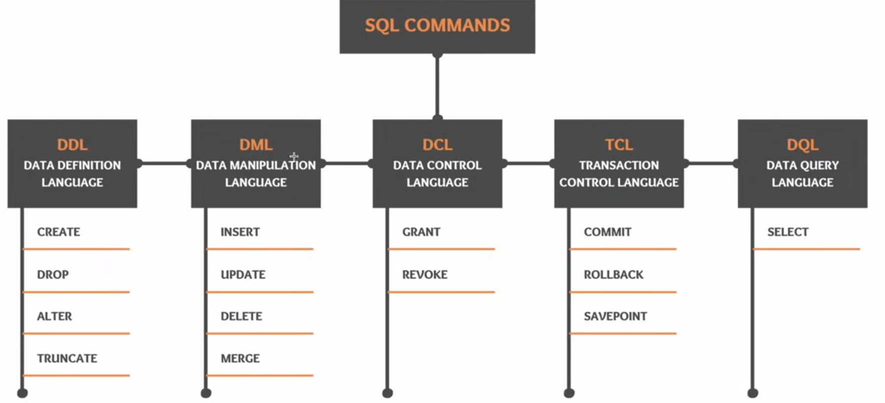

To open the psql shell,

```
$ sudo -u postgres psql
```

\l - lists all the databases

```
postgres=# CREATE DATABASE demo;
postgres=# \c demo

demo=# CREATE TABLE products(
product_id int,
product_name varchar(50),
price float,
released_date date
);
```
### Load Data

To list the tables

```
demo=# \dt
            List of tables
 Schema |   Name   | Type  |  Owner   
--------+----------+-------+----------
 public | products | table | postgres
(1 row)

demo=# INSERT INTO products (product_id,product_name,price,released_date) VALUES (1, 'iPhone 17', 102900.00, to_date('19-09-2025', 'dd-mm-yyyy'));
INSERT 0 1
demo=# INSERT INTO products (product_id,product_name,price,released_date) VALUES (2, 'iPhone 17 Pro', 130900.00, to_date('19-09-2025', 'dd-mm-yyyy'));
INSERT 0 1
demo=# INSERT INTO products (product_id,product_name,price,released_date) VALUES (3, 'iPhone 17 Pro Max', 149900.00, to_date('19-09-2025', 'dd-mm-yyyy'));
INSERT 0 1

demo=# SELECT * FROM products;
 product_id |   product_name    | price  | released_date 
------------+-------------------+--------+---------------
          1 | iPhone 17         | 102900 | 2025-09-19
          2 | iPhone 17 Pro     | 130900 | 2025-09-19
          3 | iPhone 17 Pro Max | 149900 | 2025-09-19
(3 rows)
```

### Read Data

Shows data types of columns in the table

```
demo=# \d products;
                        Table "public.products"
    Column     |         Type          | Collation | Nullable | Default 
---------------+-----------------------+-----------+----------+---------
 product_id    | integer               |           |          | 
 product_name  | character varying(50) |           |          | 
 price         | double precision      |           |          | 
 released_date | date                  |           |          | 

demo=# SELECT * FROM products WHERE price > 125000;
 product_id |   product_name    | price  | released_date 
------------+-------------------+--------+---------------
          2 | iPhone 17 Pro     | 130900 | 2025-09-19
          3 | iPhone 17 Pro Max | 149900 | 2025-09-19
(2 rows)

demo=# SELECT product_name AS "Product Name" FROM products WHERE price > 125000;
   Product Name    
-------------------
 iPhone 17 Pro
 iPhone 17 Pro Max
(2 rows)

demo=# SELECT * FROM products WHERE to_char(released_date, 'yyyy') = '2025';
 product_id |   product_name    | price  | released_date 
------------+-------------------+--------+---------------
          1 | iPhone 17         | 102900 | 2025-09-19
          2 | iPhone 17 Pro     | 130900 | 2025-09-19
          3 | iPhone 17 Pro Max | 149900 | 2025-09-19
(3 rows)

"2025" won't work.

demo=# SELECT *
FROM products
WHERE EXTRACT(YEAR FROM released_date) = 2025;
 product_id |   product_name    | price  | released_date 
------------+-------------------+--------+---------------
          1 | iPhone 17         | 102900 | 2025-09-19
          2 | iPhone 17 Pro     | 130900 | 2025-09-19
          3 | iPhone 17 Pro Max | 149900 | 2025-09-19
(3 rows)

demo=# SELECT COUNT(*) FROM products;
 count 
-------
     3
(1 row)

demo=# SELECT COUNT(*) FROM products WHERE price > 130000;
 count 
-------
     2
(1 row)

demo=# SELECT SUM(price) FROM products;
  sum   
--------
 383700
(1 row)

demo=# SELECT AVG(price) FROM products;
  avg   
--------
 127900
(1 row)
```

### Modify Data

```
demo=# UPDATE products SET price = 99999 WHERE product_name = 'iPhone 17';
UPDATE 1

LIKE 'iPhone%'
```
### Remove Data

```
demo=# DELETE FROM products WHERE product_name like 'iPhone 17 Pro%';
DELETE 2
demo=# SELECT * FROM products;
 product_id | product_name | price | released_date 
------------+--------------+-------+---------------
          1 | iPhone 17    | 99999 | 2025-09-19
(1 row)
```

INSERTED again

```
demo=# DELETE FROM products WHERE product_name NOT LIKE 'iPhone 17 Pro%';
DELETE 1
demo=# SELECT * FROM products;
 product_id |   product_name    | price  | released_date 
------------+-------------------+--------+---------------
          2 | iPhone 17 Pro     | 130900 | 2025-09-19
          3 | iPhone 17 Pro Max | 149900 | 2025-09-19
(2 rows)

demo=# TRUNCATE TABLE products;
TRUNCATE TABLE
demo=# SELECT * FROM products;
 product_id | product_name | price | released_date 
------------+--------------+-------+---------------
(0 rows)
```

### SQL COMMANDS



Backup the table along with data

CREATE TABLE products_bkp
AS
SELECT * FROM products;

Copy the schema

CREATE TABLE products_bkp2
AS
SELECT * FROM products WHERE 1 = 2;

###  Remove Table

DROP TABLE products_bkp2;

Removes entire data and structure

```
demo=# SELECT * FROM products_bkp2;
ERROR:  relation "products_bkp2" does not exist
LINE 1: SELECT * FROM products_bkp2;
```

DROP TABLE IF EXISTS products_bkp2;

```
NOTICE:  table "products_bkp2" does not exist, skipping
DROP TABLE
```

### Modify Table

ALTER TABLE products_bkp RENAME TO products;

ALTER TABLE products RENAME COLUMN product_id TO id;

ALTER TABLE products ALTER COLUMN id TYPE float;

```
demo=# SELECT * FROM products;
 id |   product_name    | price  | released_date 
----+-------------------+--------+---------------
  2 | iPhone 17 Pro     | 130900 | 2025-09-19
  3 | iPhone 17 Pro Max | 149900 | 2025-09-19
  1 | iPhone 17         |  99999 | 2025-09-19
(3 rows)

demo=# \d products;
                        Table "public.products"
    Column     |         Type          | Collation | Nullable | Default 
---------------+-----------------------+-----------+----------+---------
 id            | double precision      |           |          | 
 product_name  | character varying(50) |           |          | 
 price         | double precision      |           |          | 
 released_date | date                  |           |          | 
```

### Constraints

Primary Key Constraint

CREATE TABLE products(
product_id int PRIMARY KEY,
product_name varchar(50),
price float,
released_date date
);

```
demo=# INSERT INTO products (product_id,product_name,price,released_date) VALUES (1, 'iPhone 17', 102900.00, to_date('19-09-2025', 'dd-mm-yyyy'));
INSERT 0 1
demo=# INSERT INTO products (product_id,product_name,price,released_date) VALUES (2, 'iPhone 17 Pro', 130900.00, to_date('19-09-2025', 'dd-mm-yyyy'));
INSERT 0 1
demo=# INSERT INTO products (product_id,product_name,price,released_date) VALUES (3, 'iPhone 17 Pro Max', 149900.00, to_date('19-09-2025', 'dd-mm-yyyy'));
INSERT 0 1
```

INSERT <OID> <rows_affected>

Modern PostgreSQL versions don’t use OIDs for normal tables anymore, so it always shows 0.

CREATE TABLE products(
product_id int,
product_name varchar(50),
price float,
released_date date,
CONSTRAINT pk_prod PRIMARY KEY(product_id, product_name)
);

Composite Primary key is where multiple columns are used to create the key.

Identity Constraint (column)